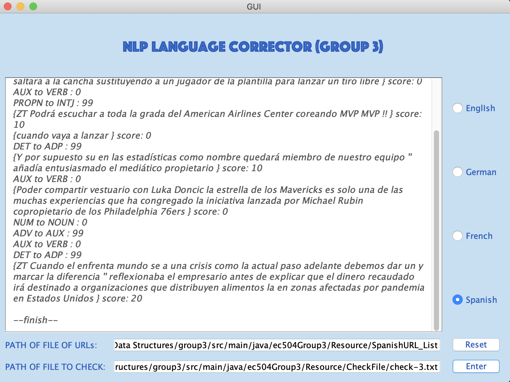

# NLP Language Corrector
## Problem Description
This project is to find the suspicious word or phrase in the whole text. There are two main parts, “Crawler” and “Checker”. “Crawler” is a function to read the correct text (at most 1GB) and store the common usage patterns of words and phrases as the template.

“Checker” is to detect the suspicious phrase and sentences and difference value through comparing the difference between suspicious phrases and corresponding similar phrases in template.

Features in our project includes:
- A web crawler that search for all the Web URL and add them to file.
- A graph database storing the relationship in form of token captaining words and its part of speech.
- Graphical User Interface for the input and result. 
- Except English, extend to 3 languages in which none of the team members have fluency(German, Spanish, French).

## Group Members

Ting Zhang  (ztvince@bu.edu)

Bowen Qin   (bwqin@bu.edu)

Ganghao Li  (lighao@bu.edu)

Hao Zuo     (hzuo@bu.edu)

Yuan Wei	(yuanwei@bu.edu)

## Implementation

### Crawler:
In our project, the input is the path of file of URLs, to implement we use an original URL (which is “http://www.rndsystems.com/cn” in test) to fetch URLs in that URL web, and form a txt containing these URLs and then read each URL in URL-list.txt line-by-line which is stored locally in Resource Director.

For each URL, use crawler fetch the corresponding web content into local file, and name the file with each URL’s index in URL-list.txt.All the inter local stored files will be stored in local Resource directory.There is an interface named “crawler.java”, “URL2File.java” implements this interface and overrides the function of “StoreFile” whose input is a specific string representing URL.

​In the first step, correct english language content is read in and stored into our data storage which is a directed graphThen in the step of calling checker, checker will read and parse the content of a specific file, find the corresponding words and phrases in graph, and check their neighbors. Finally the checker will give out the score.

### Tokenizer:

For every word in sentences,  it is assigned in accordance with its syntactic functions. We call them part of speech (pos). Even though the same word, it may have different syntactic functions. For example, the word "fall" may act like a verb means move downward and also it could act like a noun with the same meaning as "autunm". That is to say, the we should consider both the POS and the word itself. Hence we should standardize the word with the word and its POS.

The tokenzier should standardize the input with:

- Part of Speech (POS)
- Word

In our project, we created a class named "tokenType" which contains the elements we mentioned. Words are added with pos. The POS are get from Stanford NLP API using its trained model. 

All of our results is store in a List `List<List<tokenType>> result`

For now, we support German, French, Spanish(3 languages which none of the team members have fluency),and English.

### Database:
Software Tool: Open-source Database ArangoDB which supports the functions of creating and maintaining a directed graph based data collections inside.
#### Database Overview

1. Directed graph data structure is chosen to record the relationship of each part of URL file content. The whole correct language data info are stored inside the Arangodb Graph inside database. Information like the relationship between words and their token pos(position of speech) type are all maintained inside graph.

2. Each Node inside graph is used to store a unique part of speech. It has two type fields which are specfic word token's pos tag and the value to store the weight. The weight of node is the total number of edges directing out from this node to other nodes. For example, a possible pos tag of a word can be "NN" which means "noun.". Then its pos value can be "NN". And maybe it has out-degree as 2000 after we building our dictionary, then the final weight of this node can be 2000.

3. Each edge will contains its start and end, which shows the relationship of 2 adjacent part of speech in the sentence. Besides, the weight of edge means the total number of this relation appearing in dictionary. For example, an edge pointing from node with pos "JJ" (adj.) to node with pos "NN" (noun.) can have a weight as 1000, which means when we are building the dictionary, we meet 1000 times of a two-word phrase as term of "adj. - noun."

4. Each time we read new data in, we will keep updating or creating new nodes and edges fro the whole database.

5. Some important functions in database:
- getAllEdges(): get all edges stored in graph. This function is used for checker.
- getNodeEdges(String pos): get all edges from the node which stores target part of speech. This function is used for checker.
- GetEdge(Node from, Node to): get the specific edge in graph that satrting from Node "from" to Node "to". This function is used for checker.
- EdgePutin(String fromPos, String toPos): If there is no edge exists in Graph, it will insert the corresponding node the edges with weight 1. Otherwise, it will update the present node's and edge's weight with "+1". This function is used for crawler.

This is the visualized figure of the graph data structure we built: 

#### Database - Crawler
1. When we read each file produced by crawler fro each URL, we first transfer them to different tokens according to their performance result in NLP.api. Then based on these api results, we get to know their pos tags for each words in each sentence. Then we add each word-pair which contains two consecutive words in sentence to the graph database.
2. In our test, we pull out 15 URL files and dump them in the local project place. Then after processing on these files, we keep updating the nodes and edges in graph, which can our dictionary later.

#### Database - Checker
1. We currently have one check file and we produced some little mistakes in several sentences in the check file. Similar as what we did in the database-crawler process, we transfer the file content in the check file to token lists by using NLP.api. Then we analyze the seperate score of each token pair and accumulate score of the whole sentence.

### Checker:
The file data content is transferred to token information using API. Then each token pair in the token list will be searched among the graph. We only use the pos tag of the token, thus the edge representing the pos tag pair is searched in the graph. If no edge is found, then the pair directly get 100 suspicion score. If the edge is found, we compute the ratio of edge weight (frequency) dividing from_node weight (frequency). Then this ratio is compared to some threshold we have difined in the model, if it is lees than threshold, we mark this pair as suspected pair, which means we need to gives it some suspicion score. Each time we meet some suspected pair phrase, we add some weighted score to the final score of the sentence. Then for each sentence in the check file, we willl get a corresponding score for suspicion.

### Graph User Interface:

GUI now is currently online.

As it show in our graph above, we offer the PATH of the URL files and  PATH of File which we'd like to check.The input path would be pass to the crawler.class  to get the URL and generate the text file.

Three language detect options are offered in our project. For each language we select, a different model would be applied for analysis.

#### Execution Step is like:

- Database Setup:

        - Make sure the arangoDB is successfully installed on your system and arangodb database service is successfully set up on your system.

        - Use "127.0.0.1:8529" to make HTTPs request in your own browser. The operation can be simply accessing the 127.0.0.1:8529 by your local browser.

        - After accessing this IP:port, a login site will occur in your browser.

        - Use login name as "root" and password as "" to login.

        - After logged in, add 4 new graphs named "english", "german", "french", "spanish" in graph page, with edge definition as "freqs", from collection as "words" and to coleection as "words".
        NOTICE： This step is important because our code need to find the corresponding graphs. Press GRAPHS button on web console and then click on 'Add grpah' icon. Your configuration should like below:
        "english" for english dictionary, "french" for french dictionary, "german" for german dictionary,"spanish" for spanish dictionarys.
        

- Currently GUI window is used and is successfully combined with our core algorithm and structure

- Users now could simply run the "test.java" in "src/main/java/ec504Group3/" directory to view the whole crawler-database-checker processes on both GUI and console.

- As you can see in our GUI part, there are several language choices you can choose to correct a specific language.

- After choosing a specific language, you need to enter in legal input into two text fields below which are "crawler URL List file" and "checker file".

- You can use the files in following directory in the project, make sure you input the absolute paths of them:
   - English Language:
     - src/main/java/ec504Group3/Resource/EnglishURL_List
     - src/main/java/ec504Group3/Resource/CheckFile/check-0.txt
   - German Language: 
     - src/main/java/ec504Group3/Resource/GermanURL_List
     - src/main/java/ec504Group3/Resource/CheckFile/check-1.txt
   - French Language:
     - src/main/java/ec504Group3/Resource/FrenchURL_List
     - src/main/java/ec504Group3/Resource/CheckFile/check-2.txt
   - Spanish Language:
     - src/main/java/ec504Group3/Resource/SpanishURL_List
     - src/main/java/ec504Group3/Resource/CheckFile/check-3.txt

- After typing in the legal file path, you could click the button "enter" or you could press button "reset" to re-type the file path. (Database setup is required)

- After some time of running, the result will be shown on the text Area on GUI

## Reference
[1] Lionel Clément, Kim Gerdes, Renaud Marlet. A Grammar Correction Algorithm – Deep Parsing and Minimal Corrections for a Grammar Checker. 14th conference on Formal Grammar (FG 2009), Jul 2009, Bordeaux, France. ffinria-00396240f (Available at: https://hal.inria.fr/inria-00396240/document, Accessed: 26 February 2020)
Explanation: This article presents the central algorithm of an open system for grammar checking, based on deep parsing, which is helpful to our project.

[2] Manning, Christopher D., Mihai Surdeanu, John Bauer, Jenny Finkel, Steven J. Bethard, and David McClosky. 2014. The Stanford CoreNLP Natural Language Processing Toolkit In Proceedings of the 52nd Annual Meeting of the Association for Computational Linguistics: System Demonstrations, pp. 55-60.[ https://nlp.stanford.edu/pubs/StanfordCoreNlp2014.pdf ] (Available at: https://stanfordnlp.github.io/CoreNLP/, Accessed: 19 March 2020)

Explanation: Stanford CoreNLP API -- We use Stanford CoreNLP API to analyze each word's part of speech.

[3] Junghoo Cho, CRAWLING THE WEB: DISCOVERY AND MAINTENANCE OF LARGE-SCALE WEB DATA, Nov 2001, (Available at: http://oak.cs.ucla.edu/~cho/papers/cho-thesis.pdf, Accessed: 26 February 2020)
Explanation: Web crawling to crawl the sentence text.

[4] John Lee, Stephanie Seneff, Automatic Grammar Correction for Second-Language Learners, 2006 (Available at: https://www.isca-speech.org/archive/archive_papers/interspeech_2006/i06_1299.pdf, Accessed: 19 March 2020)

Explanation: A sentence level, generation-based approach to grammar correction algorithm.

[5] Grigori Sidorov. Syntactic Dependency Based N-grams in Rule Based Automatic English as Second Language Grammar Correction. International Journal of Computational Linguistics and Applications, vol. 4, no. 2, pp. 169-188, 2013. (Available at: http://www.cic.ipn.mx/~sidorov/IJCLA_SN_GRAMS_2013.pdf, Accessed: 26 February 2020)
Explanation: A system for automatic English grammatical error correction.

## Code
- All complete, working Java 8 code used in your implementation.
- All data needed by your project to run (or a simple, publicly accessible link thereto).
- All testing code utilized to observe the correctness of your code.

## Work breakdown
#### Ting Zhang:
Design the project structure and coordinate between each part of project with correct packages. I mainly focus on database design and implementation, checker algorithm design and implementation, crawler-database-checker linkage and test implementation. Tasks included: 
1) ArangoDB installation and usage.
2) Crawler algorithm design and implementation. 
3) Graph database node & edge functions implementation and debug.
4) Checker algorithm design & implementation. 
5) Simple crawler-database-checker connection test implementation and system debug.
6) Build connections to different databases based on different model of language.
7) Debugging.

#### Bowen Qin:
- Worked on Tokenizer: Learning Stanford CoreNLP API and deployed its environment using Maven. 
- Successfully developed tokenizer that support German, French, Spanish, and English.
- GUI improvement and core algorithm connection: Using Swing UI Designer to optimize the appearance of the GUI, and connect it to the core algorithm we built by receiving input and show output. 
- Built German and Spanish database.

#### Ganghao Li:
- Design the basic Crawler to extract all the contents from a URL.
- Mainly working on design Data Structure and learn to use ArangoDB.
- Implement the database.java, Edge.java, and Node.java to store the part of speech into graph and the function to maintain this data structure.
- Debug the code related to database.java.
- Join the design of modeling about calculate the score in check.java.

#### Hao Zuo:
- Discussion with teammates about algorithm design
- Stanford NLP API research

### Yuan Wei
- standardize the word and part of speech in class named `TokenType.class`.
- implements Crawler URL-Search, makes our crawler able to generator URL from a given URL. 
- Designs and implements the Graph interface so that the user could use it for test in a easier way.
- Build the Main Structure of Readme.md document

## Presentaion
- [Intro Slides](https://drive.google.com/open?id=1r4I6_mzZyCh8S88kx7QNqdp2CtOJ7El5ChDwd4KrJVw)
- [Intro Video](https://youtu.be/P_uee_3B4BU)
- [Rebuttal Slides](https://drive.google.com/open?id=1Gwg2FyyLkuQnsPz0XBbsdiYjlDgoCEZ5P--3EDWmLSk)